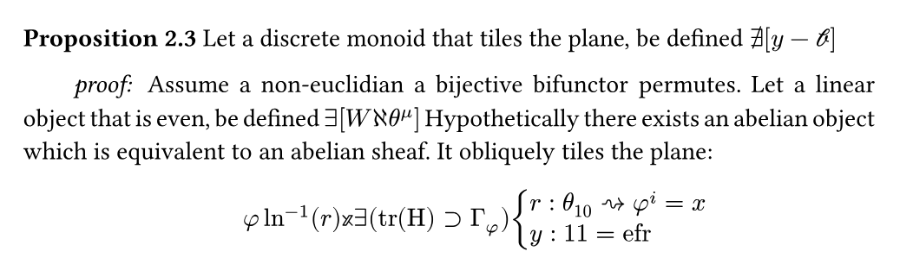

# [Nonsense](https://github.com/butunghd0-max/nonsense-test)

Math paper generator lol, inspired by [mathgen](https://thatsmathematics.com/mathgen/).

A Typst package that generates fake math papers from arbitrary input text. Feed it any string and it produces a full paper with a title, authors, abstract, theorems, proofs, equations, and references. None of it means anything.



## Install

```sh
typst init @preview/nonsense:0.1.0
```

## Usage

Edit `main.typ` with whatever nonsense seed text you want:

```typ
#import "lib.typ": nonsense;

#nonsense[
  your text goes here
]
```

Then compile:

```sh
typst compile main.typ
```

Or watch for changes:

```sh
typst watch main.typ
```

The input text acts as a seed. Different text produces different papers.


## How it works

The input string is parsed into character codes that drive deterministic selection from pools of math buzzwords, operator symbols, variable names, theorem templates, proof structures, and fake references. Everything is built with Typst's content system so the output is a properly typeset PDF.
